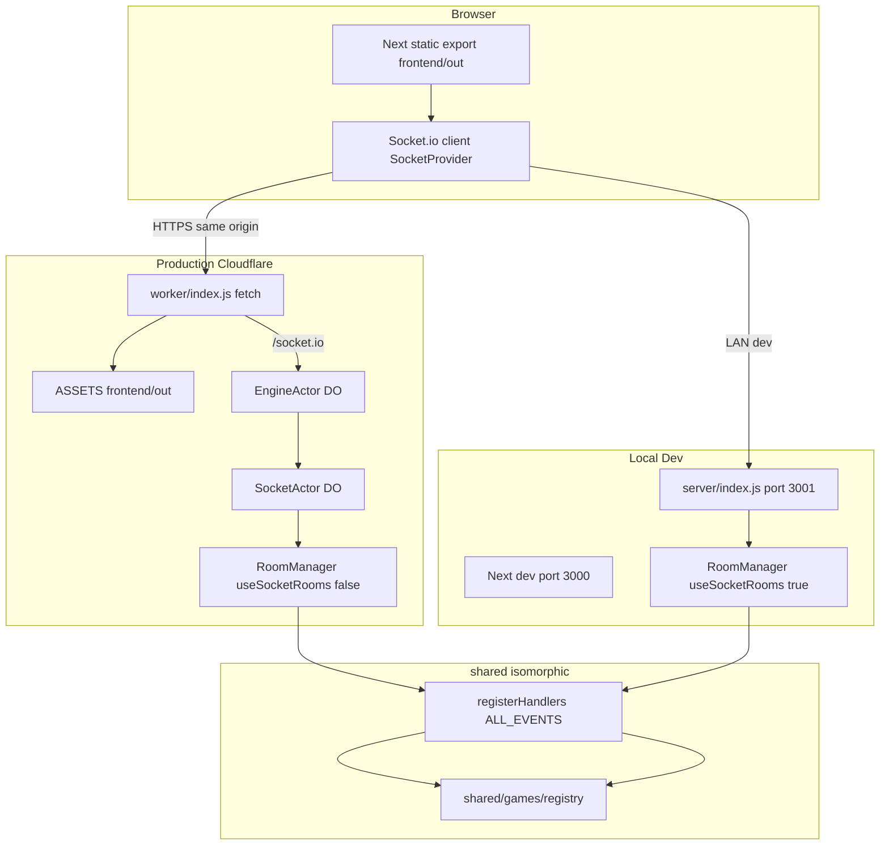
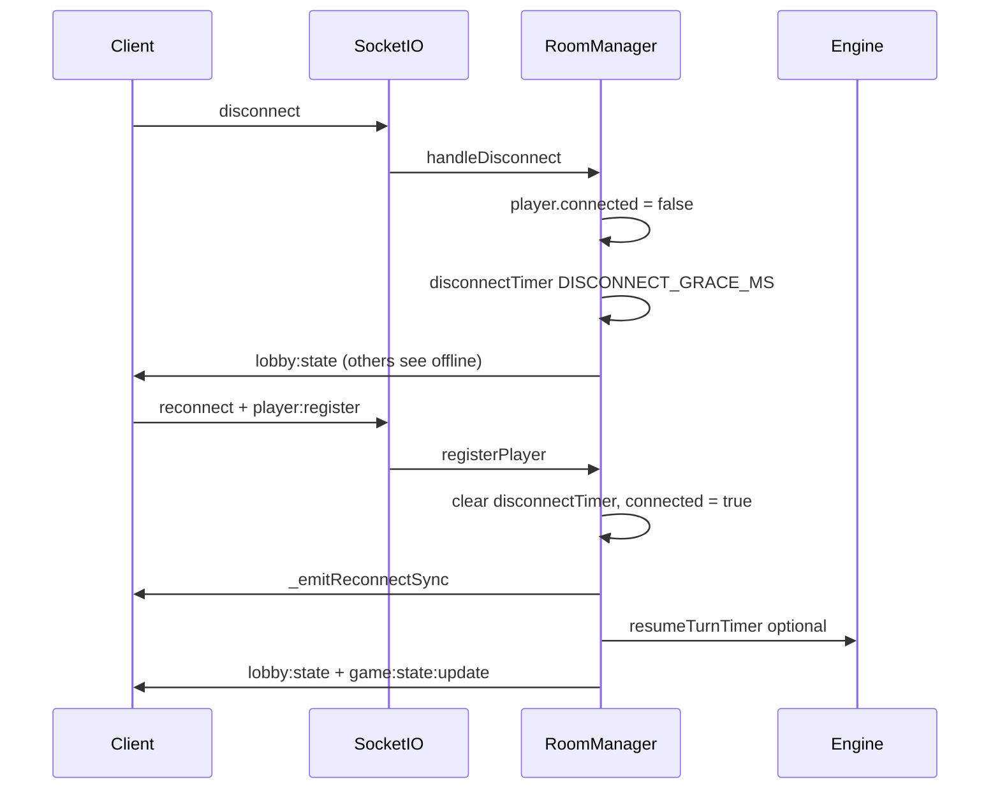

# System Architecture

**Audience:** Contributors and operators working on LeTeam Game Hub.  
**Related docs:** [GUIDE_ADDING_GAMES.md](./GUIDE_ADDING_GAMES.md) · [SECURITY_PERFORMANCE.md](./SECURITY_PERFORMANCE.md) · [README.md](../README.md)

LeTeam Game Hub is a browser-based multiplayer party-game platform. Players use a **static Next.js frontend** for UI and a **WebSocket hub** for real-time rooms, lobbies, and match state. All authoritative game rules live in an **isomorphic `shared/` layer** consumed identically by the local dev server and the production Cloudflare Worker.

---

## Executive Summary

| Layer | Path | Role |
|-------|------|------|
| Frontend | `frontend/` | Next.js App Router, static export (`frontend/out`), Socket.io client |
| Shared | `shared/` | Game engines + hub (`RoomManager`, event registry, session security) |
| Local hub | `server/` | Express + Socket.io on port **3001** (dev/LAN only) |
| Production hub | `worker/` | Cloudflare Worker + Durable Objects (`EngineActor`, `SocketActor`) |

The root [`package.json`](../package.json) orchestrates packages via `--prefix` scripts (this is a **manual monorepo**, not npm workspaces). Production serves static assets and `/socket.io` from the **same origin**; local dev splits Next (**3000**) and the hub (**3001**).

---

## Monorepo Topology

### Directory layout

```
LeTeam-GameHub/
├── package.json          # dev, build, deploy scripts
├── wrangler.toml         # Worker, assets, Durable Object bindings
├── README.md             # setup and deploy
├── docs/                 # architecture and contributor guides (this folder)
├── frontend/             # Next.js → frontend/out
├── server/               # local Socket.io hub
├── worker/               # Cloudflare Worker entry (worker/index.js)
└── shared/
    ├── hub/              # RoomManager, registerHandlers, eventRegistry
    └── games/            # *Engine.js per game, registry.js
```

### Communication paths



### Package responsibilities

| Path | Runtime | Responsibility |
|------|---------|----------------|
| [`frontend/`](../frontend/) | Browser | UI, routing, client socket layer; built with `output: 'export'` in [`frontend/next.config.js`](../frontend/next.config.js) |
| [`shared/`](../shared/) | Node + Worker | Pure/isomorphic hub logic and game engines |
| [`server/`](../server/) | Node (dev) | [`server/index.js`](../server/index.js) — Express health + Socket.io with native rooms |
| [`worker/`](../worker/) | Cloudflare | [`worker/index.js`](../worker/index.js) — static assets + Engine.io/Socket.io via Durable Objects |

### Frontend build and assets

- **Static export:** `frontend/next.config.js` sets `output: 'export'` and `trailingSlash: true`. Build output is `frontend/out/`.
- **Shared import alias:** `@shared/*` → `../shared/*` (webpack + TypeScript paths).
- **Production assets:** [`wrangler.toml`](../wrangler.toml) `[assets]` serves `frontend/out` with SPA fallback; Worker runs first for `/socket.io/*` and `/health`.

### Cross-package imports

| Consumer | Imports from `shared/` via |
|----------|----------------------------|
| `server/index.js` | Relative `../shared/hub/...` |
| `worker/index.js` | Relative `../shared/hub/...` |
| `frontend/` | `@shared/...` alias |

---

## Dual-Backend Model

Both backends instantiate the same [`RoomManager`](../shared/hub/RoomManager.js) and [`registerHandlers`](../shared/hub/registerHandlers.js). The only structural difference is how Socket.io targets connected clients.

| Concern | Local [`server/index.js`](../server/index.js) | Production [`worker/index.js`](../worker/index.js) |
|---------|--------------------------------------------------|-----------------------------------------------------|
| **Port / host** | `PORT` default **3001**, `HOST` `0.0.0.0` | HTTPS on configured custom domain |
| **`RoomManager` option** | `useSocketRooms: true` — `socket.join(roomId)` | `useSocketRooms: false` — `io.to(socketId).emit(...)` |
| **Static UI** | Next dev server **3000** | `env.ASSETS.fetch(req)` from `frontend/out` |
| **Socket URL** | [`frontend/lib/socket-url.ts`](../frontend/lib/socket-url.ts) → dev hub URL | Same origin (`/socket.io`) on HTTPS |
| **CORS / origin** | [`server/cors.js`](../server/cors.js) | [`shared/hub/security.js`](../shared/hub/security.js) `isAllowedSocketRequest` |
| **Process model** | Long-lived Node process | Singleton Durable Object cluster (`engineActor.idFromName("singleton")`) |

### Durable Object actors (production)

From [`worker/index.js`](../worker/index.js) and [`wrangler.toml`](../wrangler.toml):

| Binding | Class | Role |
|---------|-------|------|
| `engineActor` | `EngineActor` | Engine.io layer; routes to `socketActor` |
| `socketActor` | `SocketActor` | Socket.io server; `onServerCreated` / `onServerStateRestored` attach handlers |
| `ASSETS` | — | Serves `frontend/out` |

`attachConnectionHandlers` creates one module-level `RoomManager` and registers `registerHandlers` per socket connection.

---

## State Management Flow

### Principle: identity decoupled from match state

Clients hold **hints** (player id, display name, session token, UI preferences) in browser storage. The server holds **truth** for who is in which room, match phase, scores, hidden roles, and timers. Clients never send full state trees; they send **intent events** validated and applied by `RoomManager` + game engines.

### Client-side identity

| Concern | Location |
|---------|----------|
| Player id | [`frontend/lib/player.ts`](../frontend/lib/player.ts) `getOrCreatePlayerId()` |
| Session + display name | [`frontend/lib/session/core-session.ts`](../frontend/lib/session/core-session.ts) — key `leteam_core_session` |
| Socket registration | [`frontend/lib/hub/SocketProvider.jsx`](../frontend/lib/hub/SocketProvider.jsx) emits `player:register` on connect |
| App wiring | [`frontend/app/providers.tsx`](../frontend/app/providers.tsx) — `ClientStorageProvider` → `SocketProvider` |

### Server-side source of truth: `RoomManager` maps

Defined in [`shared/hub/RoomManager.js`](../shared/hub/RoomManager.js):

| Map | Purpose |
|-----|---------|
| `rooms` | `roomId` → room object (`status`, `players`, `spectators`, `game`, `settings`, timers) |
| `playerToRoom` | Active player → `roomId` |
| `spectatorToRoom` | Spectator → `roomId` |
| `playerToSocket` | `playerId` → current `socket.id` |
| `socketToPlayer` | `socket.id` → `playerId` |
| `playerSessions` | `playerId` → 64-char hex session token |
| `hubPresence` | Hub-wide presence and invite metadata |
| `pendingInvites` | Cross-room invite records |

**Per-room indexing:** `room.playersById` is a `Map<playerId, playerRow>` for **O(1)** `_getRoomPlayer(room, playerId)` instead of scanning `room.players` on hot paths.

### Room object shape (lobby)

Created in `createRoom` (see `RoomManager.js`):

| Field | Typical value |
|-------|----------------|
| `id` | Short room code |
| `hostId` | Creator player id |
| `status` | `"lobby"` → `"playing"` → `"finished"` |
| `gameType` | Key from [`shared/games/registry.js`](../shared/games/registry.js) |
| `players` | `{ id, displayName, connected, disconnectTimer, tabFocused }[]` |
| `spectators` | Optional spectator rows |
| `game` | `null` in lobby; engine instance when playing |
| `settings` | Game-specific lobby settings (defaults from `shared/hub/constants.js`) |
| `createdAt` / `lastActivityAt` | Activity tracking for idle purge |

### Outbound broadcast contracts

| Event | When | Payload shape |
|-------|------|----------------|
| `lobby:state` | Lobby or membership change | Per-viewer settings via `_lobbySettingsForViewer` (e.g. Mafia hides narrator secrets from non-host) |
| `game:state:update` | Match state change | `{ roomId, ...serializeForPlayer(viewerId) }` per connected player/spectator |
| `hub:presence:update` | Hub presence change | Online players, inviteable flags |
| Game-specific side channels | High-frequency or transient data | e.g. `sketch-draw:canvas:stroke:batch` (not in main state snapshot) |

### Reconnect sequence



Special case: **Secret Word** (`wordgame`) can soft-disconnect without removing the player slot immediately (`shouldPreserveWordGameRoom`). See [SECURITY_PERFORMANCE.md](./SECURITY_PERFORMANCE.md).

---

## Isomorphic Pipeline Model

Every client action flows through the same registry on both backends.

### End-to-end cycle

1. **Load UI** — Browser requests static route from `frontend/out` (e.g. `frontend/app/mafia/page.tsx` dynamically imports `MafiaClient`).
2. **Connect socket** — [`SocketProvider`](../frontend/lib/hub/SocketProvider.jsx) calls `io(resolveServerUrl())` and, on `connect`, `player:register` with ack.
3. **Register listeners** — [`registerHandlers`](../shared/hub/registerHandlers.js) binds every entry in `ALL_EVENTS` from [`eventRegistry.js`](../shared/hub/eventRegistry.js).
4. **Secure execution** — Each inbound event runs [`executeSecureEvent`](../shared/hub/executeSecureEvent.js):
   - Rate limit (`rateLimiter` + `actionKey` + `rateLimit`)
   - `requiresRegistered` (socket mapped to player)
   - `requiresAuth` (`verifyPlayerSession` on payload `playerId` + `sessionToken`)
   - `validate(payload)` → error string or continue
   - `handler(socket, payload, roomManager)`
   - Ack `{ success: true, ... }` or `{ error }` (+ optional `game:error` / `protocol:error`)
5. **Mutate state** — Handler updates `RoomManager` maps and/or `room.game` engine methods.
6. **Broadcast** — `broadcastLobbyState` / `broadcastGameState` (16ms debounce for game state) / targeted emits for side channels.

### Handler registration (shared contract)

```javascript
// shared/hub/registerHandlers.js
export function registerHandlers(socket, roomManager) {
  for (const config of ALL_EVENTS) {
    socket.on(config.event, (payload, ack) => {
      executeSecureEvent(socket, payload, config, roomManager, ack);
    });
  }
  socket.on('disconnect', () => {
    roomManager.handleDisconnect(socket);
  });
}
```

### Game engine integration

| Step | Location |
|------|----------|
| Resolve game definition | [`getGame(gameType)`](../shared/games/registry.js) |
| Start match | `RoomManager.startGame` → `gameDef.createEngine(playerIds, settings)` |
| Attach engine | `room.game.roomId = roomId`; `room.status = 'playing'` |
| Per-viewer snapshot | `room.game.serializeForPlayer(player.id)` inside `_broadcastGameStateNow` |
| Destroy | `_destroyRoom` → `room.game.teardown()` |

Engines extend [`BaseGameEngine`](../shared/games/BaseGameEngine.js). See [GUIDE_ADDING_GAMES.md](./GUIDE_ADDING_GAMES.md).

### Hub interval loops (server-side timers)

`RoomManager` runs background intervals for games that need wall-clock ticks without client authority, e.g.:

| Set | Purpose |
|-----|---------|
| `_dominoTurnRoomIds` | Domino turn timer / auto-play |
| `_baraPhaseRoomIds` | Bara Alsalfafa phase ticks |
| `_sketchPhaseRoomIds` | Sketch Draw phase countdown |

Game engines may also use `BaseGameEngine.startTimeout(key, durationMs, onExpire)` for per-engine timers.

---

## Shared Layer Isolation Boundary

Code under `shared/` must run in **both** Node (`server/`) and the Cloudflare Worker runtime. Treat it as a hard boundary.

### Permitted

- Pure JavaScript data structures (`Map`, `Set`, plain objects)
- `crypto.getRandomValues` (session tokens, room ids)
- `setTimeout` / `clearTimeout` in engines and `RoomManager` (Worker with `nodejs_compat`)
- Imports from other `shared/` modules

### Forbidden in `shared/games/*` and ideally all `shared/hub/*`

| Dependency | Why |
|------------|-----|
| Node `fs`, `path`, `child_process` | Not available in Worker |
| `process.env` in engines | Environment-specific; use Worker `vars` only at worker boundary |
| Cloudflare `env` bindings | Belongs in `worker/index.js` only |
| `window`, `document`, React | Frontend-only |
| Socket.io client | Server/worker server role only |

Hub code may use Socket.io **server** types via `RoomManager`’s `io` reference passed from each backend’s server instance.

---

## Frontend Architecture (Summary)

| Piece | Path |
|-------|------|
| Routes | `frontend/app/*/page.tsx` |
| Game clients | `frontend/games/<game-id>/*Client.tsx` |
| Lobby shell | `frontend/components/ui/GameLobbyCore.tsx` |
| Match shell | `frontend/components/ui/GameClientFrame.tsx` |
| Room hook | `frontend/hooks/useGameRoom.ts` |
| Catalog | `frontend/lib/hub/games-registry.ts` |

Socket state is split across narrow React contexts (timer, sketch canvas, game state) — see [SECURITY_PERFORMANCE.md](./SECURITY_PERFORMANCE.md).

---

## Deploy and Local Dev Pointers

| Task | Command / doc |
|------|----------------|
| Install + dev | `npm run install:all`, `npm run dev` — [README.md](../README.md) |
| Static build | `npm run build` → `frontend/out` |
| Production deploy | `npm run deploy` / Workers Builds + `wrangler deploy` |

**Do not expose** `server/` to the public internet; it is for local/LAN development only.

---

## Document Index

| Document | Contents |
|----------|----------|
| [GUIDE_ADDING_GAMES.md](./GUIDE_ADDING_GAMES.md) | Step-by-step new game integration |
| [SECURITY_PERFORMANCE.md](./SECURITY_PERFORMANCE.md) | Memory, bandwidth, auth, hydration, React performance guardrails |
