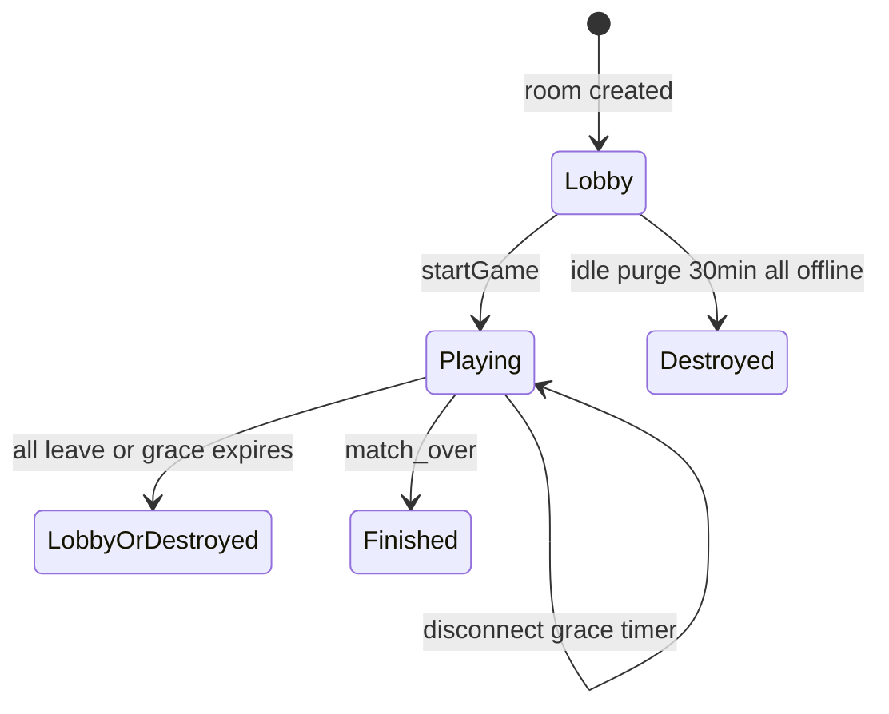

# Security and Performance Guardrails

**Audience:** Contributors implementing hub, engine, or frontend features.  
**Related docs:** [ARCHITECTURE.md](./ARCHITECTURE.md) · [GUIDE_ADDING_GAMES.md](./GUIDE_ADDING_GAMES.md)

These constraints exist because production runs inside a **singleton in-memory Durable Object** without a durable room database, and the frontend is a **static Next.js export** with strict hydration rules. Violating them causes memory growth, bandwidth spikes, auth bypasses, or React render storms.

---

## 1. Durable Object Heap Memory Conservation

### 1.1 Production runtime model

| Property | Detail |
|----------|--------|
| Entry | [`worker/index.js`](../worker/index.js) |
| Socket routing | `env.engineActor.idFromName('singleton')` → `EngineActor` → `SocketActor` |
| Room state | Single module-level [`RoomManager`](../shared/hub/RoomManager.js) in the DO process |
| Persistence | **No** long-term disk backup of rooms; all maps are in-process RAM |

When a room is destroyed, every reference must be dropped so the garbage collector can reclaim the room object, engine, timers, and player index entries.

### 1.2 `_destroyRoom` — explicit map unanchoring

Implementation: [`RoomManager._destroyRoom`](../shared/hub/RoomManager.js) (approximately lines 242–291).

**Required cleanup sequence:**

| Step | Action |
|------|--------|
| 1 | Clear each player's `disconnectTimer`; cancel pending invites for players and spectators |
| 2 | `_clearNextRoundTimer(room)`, `_clearAutoPlayTimer(room)` |
| 3 | `room.game?.teardown?.()` — clears engine `timers` |
| 4 | Clear `_gameStateFlushTimers` entry for `roomId` |
| 5 | For each **player**: `delete` from `playerToRoom`, `spectatorToRoom`, `playerToSocket`; conditional `hubPresence.delete(id)` if no other socket; `_unindexRoomPlayer` |
| 6 | For each **spectator**: same `delete` pattern |
| 7 | Remove `roomId` from `_dominoTurnRoomIds`, `_baraPhaseRoomIds`, `_sketchPhaseRoomIds` |
| 8 | `this.rooms.delete(roomId)` |

Use the **`delete` operator** on `Map` instances — assigning `undefined` does not release the bucket.

```javascript
// Required pattern
this.playerToRoom.delete(playerId);
this.playerToSocket.delete(playerId);
this.rooms.delete(roomId);
```

**Do not** retain `room` or `room.game` in module-level caches, closures, or interval callbacks after destroy.

### 1.3 Lobby expiration lifecycle

Constants in [`shared/hub/constants.js`](../shared/hub/constants.js):

| Constant | Value | Use |
|----------|-------|-----|
| `LOBBY_IDLE_PURGE_MS` | `30 * 60 * 1000` (30 minutes) | Idle **non-playing** room purge |
| `LOBBY_DISCONNECT_GRACE_MS` | 30 minutes | Alias / disconnect grace |
| `DISCONNECT_GRACE_MS` | 30 minutes | Player removal timer after disconnect |

**Idle lobby purge** (`_startCleanupLoop`, 60s interval):

- Skips rooms with `status === 'playing'`
- Skips preserved word-game rooms (`shouldPreserveWordGameRoom`)
- Purges when **all** players have `connected === false` **and** `now - (lastActivityAt ?? createdAt) > LOBBY_IDLE_PURGE_MS`

This is **aggressive** for abandoned pre-game lobbies — intentional for DO memory bounds.

### 1.4 Active match disconnect retention

**Different policy** for in-progress games:

| Behavior | Location |
|----------|----------|
| `handleDisconnect` | Sets `player.connected = false`; starts `disconnectTimer` for `DISCONNECT_GRACE_MS` before `_removePlayerFromRoom` |
| Reconnect | `registerPlayer` clears timer, sets `connected = true`, `_emitReconnectSync`, `broadcastGameState` |
| Word game | `shouldPreserveWordGameRoom` — soft disconnect may keep slot without immediate removal |

Running matches are **not** subject to the idle lobby purge while `status === 'playing'`. Disconnect grace gives players time to reconnect without ending the match immediately.



---

## 2. Network Bandwidth Optimization

### 2.1 Game state broadcast — 16ms coalescing

[`RoomManager._scheduleBroadcastGameState`](../shared/hub/RoomManager.js):

- At most **one** pending flush per `roomId`
- `setTimeout(..., 16)` → `_broadcastGameStateNow` (~60fps cap on authoritative snapshots)
- Each connected player receives `game:state:update` with `room.game.serializeForPlayer(player.id)`

**Implication:** Anything included in `serializeForPlayer` is multiplied by player count × up to ~60 snapshots/sec during rapid mutations. Keep payloads small.

### 2.2 High-frequency stream separation (Sketch Draw)

**Never** embed live drawing paths in `serializeForPlayer` during active drawing.

| Channel | Event | Purpose |
|---------|-------|---------|
| Authoritative state | `game:state:update` | Phase, scores, permissions, empty `canvasBuffer` while drawing |
| Live strokes | `sketch-draw:canvas:stroke:batch` | Incremental stroke batches to room except drawer |
| Full resync | `sketch-draw:canvas:sync` | Full buffer for undo/redo/clear/fill or recovery |
| Rejoin | `sketch-draw:canvas:recovery:request` | Requester gets targeted `canvas:sync` |

Server handler: `handleSketchDrawCanvasStrokeBatch` in [`RoomManager.js`](../shared/hub/RoomManager.js) — validates drawer, `appendCanvasBatch`, emits batch without `broadcastGameState` for every point.

Engine comment ([`SketchDrawEngine.js`](../shared/games/sketch-draw/SketchDrawEngine.js)):

> Live strokes use `sketch-draw:canvas:stroke:batch`; full buffer only after the round.

#### Rate limiting (server)

From [`constants.js`](../shared/hub/constants.js) with `RATE_LIMIT_WINDOW_MS = 60_000`:

| `actionKey` | Limit per socket per minute |
|-------------|----------------------------|
| `sketchDrawCanvasBatch` | 120 |
| `sketchDrawCanvasRecovery` | 10 |
| `sketchDrawCanvasUndo` / `Redo` | 30 each |

There is **no** fixed 45ms server batch timer in the codebase. Throttling is **rate-limit + client chunking**.

#### Client chunking

[`frontend/games/sketch-draw/lib/fabricBoard.ts`](../frontend/games/sketch-draw/lib/fabricBoard.ts):

- `CLIENT_MAX_POINTS = 480` per emit
- `splitStrokePayload()` splits long strokes before `sketchDrawStrokeBatch` emit

[`SketchCanvasContext.tsx`](../frontend/lib/hub/socket/SketchCanvasContext.tsx) emits `sketch-draw:canvas:stroke:batch`; listeners update via [`socketDispatchRegistry`](../frontend/lib/hub/socket/dispatch-registry.ts), not `GameStateContext`.

### 2.3 Algorithmic complexity in hot paths

Prefer **O(1)** `Map` lookups in handlers invoked on every move or tick:

| Preferred | Avoid in hot paths |
|-----------|-------------------|
| `this.rooms.get(roomId)` | `Array.find` over all rooms |
| `this.playerToRoom.get(playerId)` | Scanning `room.players` each event |
| `room.playersById.get(playerId)` | `room.players.find(p => p.id === playerId)` |

`RoomManager` maintains `playersById` explicitly for `_getRoomPlayer`. New handlers should use it.

Cold paths (invite scan, hub presence build) may iterate collections — do not copy those patterns into move handlers or 1Hz loops.

### 2.4 `BaseGameEngine.TRANSIENT_KEYS`

Defined in [`BaseGameEngine.js`](../shared/games/BaseGameEngine.js):

```javascript
static TRANSIENT_KEYS = ['canvasBuffer', 'canvasUndoStack', 'canvasRedoStack'];
```

Do not add large ephemeral arrays to `serializeForPlayer`. Use side channels or omit until phase end.

---

## 3. Identity Verification and Session Continuity

### 3.1 Trust-on-first-use schema

[`verifyPlayerSession`](../shared/hub/session.js):

| Case | Behavior |
|------|----------|
| No token stored for `playerId` | Generate new token (`SESSION_TOKEN_BYTES = 32` → **64 hex chars**), store in `playerSessions`, return `{ ok: true, sessionToken }` |
| Token missing on subsequent calls | `{ error: 'Session token required' }` |
| Token mismatch | `{ error: 'Invalid session token' }` — strict string equality |
| Token match | `{ ok: true, sessionToken: existing }` |

```javascript
if (sessionToken !== existing) {
  return { error: 'Invalid session token' };
}
```

### 3.2 Client storage namespace

| Key / API | File |
|-----------|------|
| `leteam_core_session` | [`frontend/lib/session/core-session.ts`](../frontend/lib/session/core-session.ts) |
| `getSessionToken` / `setSessionToken` | [`frontend/lib/player.ts`](../frontend/lib/player.ts) |

### 3.3 `player:register` pipeline

1. [`SocketProvider`](../frontend/lib/hub/SocketProvider.jsx) on `connect` emits:

```javascript
socket.emit('player:register', {
  playerId: id,
  displayName: getDisplayName() || 'Player',
  sessionToken: getSessionToken() || undefined,
}, ack);
```

2. Server [`registerPlayer`](../shared/hub/RoomManager.js) calls `_resolvePlayerSession` → `verifyPlayerSession`.
3. Ack returns `sessionToken`; client persists via `setSessionToken`.
4. On `'Invalid session token'` / `'Session token required'`, client may `clearSessionToken()` and retry.

### 3.4 Authenticated socket events

[`executeSecureEvent`](../shared/hub/executeSecureEvent.js) when `requiresAuth: true`:

- Reads `payload.playerId` and `payload.sessionToken`
- Calls `verifyPlayerSession(roomManager.playerSessions, playerId, sessionToken)`
- Emits `protocol:error` with `code: 'SESSION_INVALID'` on failure

**Contract:** Sensitive game actions must include both fields in the payload and set `requiresAuth: true` in `eventRegistry.js`.

### 3.5 Session supersede (duplicate tab)

If the same `playerId` connects from a new socket, [`registerPlayer`](../shared/hub/RoomManager.js) disconnects the previous socket with `session:superseded`. Prevents two controllers for one identity.

### 3.6 Registration vs auth

| Flag | Meaning |
|------|---------|
| `requiresRegistered` | `socketToPlayer` must map socket → player (post-`player:register`) |
| `requiresAuth` | Valid session token for `payload.playerId` |

`player:register` itself is not `requiresAuth`; it establishes the session.

---

## 4. Hydration Conflict Prevention (Static Export)

Next.js static export still **pre-renders** shell HTML. Any `localStorage` read during render causes server/client mismatch.

### 4.1 App-level storage gate

[`ClientStorageProvider`](../frontend/lib/session/ClientStorageContext.tsx):

- Calls `initializeClientStorage()` in `useEffect`
- Shows loader until `ready`
- Wrapped in [`frontend/app/providers.tsx`](../frontend/app/providers.tsx) **above** `SocketProvider`

### 4.2 Per-key hydration

[`useBrowserStorage`](../frontend/hooks/useBrowserStorage.ts):

- Initial state uses SSR-safe fallback
- After mount, reads storage and sets `isHydrated: true`

[`useCoreSession`](../frontend/hooks/useCoreSession.ts) exposes `isHydrated` for game clients.

### 4.3 Game client pattern

```tsx
const { isHydrated } = useCoreSession();

if (!isHydrated) {
  return <GameLobbyPendingOverlay message="Loading session…" />;
}
```

Used in all `*Client.tsx` under `frontend/games/`.

### 4.4 SSR guards in libs

[`core-session.ts`](../frontend/lib/session/core-session.ts), [`player.ts`](../frontend/lib/player.ts):

```typescript
if (typeof window === 'undefined') return /* fallback */;
```

### 4.5 Portals and modals

Match-over modals and [`InvitationOverlay`](../frontend/components/invitations/InvitationOverlay.tsx) use a `mounted` flag + `useEffect` before `createPortal` to avoid SSR/DOM mismatch.

**Rule:** Defer any layout that depends on stored identity, room code from URL + storage, or `window` dimensions until `isHydrated` or `mounted`.

---

## 5. Context Performance Boundaries

### 5.1 Problem

A single React context updated at 60Hz forces **every** consumer to re-render. Game hub splits socket-driven state deliberately.

### 5.2 Provider stack (outer → inner)

From [`SocketProvider.jsx`](../frontend/lib/hub/SocketProvider.jsx):

| Provider | File | Updates |
|----------|------|---------|
| `HubLiveProvider` | `HubLiveContext.tsx` | Hub presence, connection errors |
| `HardResetProvider` | `HardResetContext.tsx` | Full reset |
| `SocketConnectionProvider` | `SocketConnectionContext.tsx` | `connected`, `playerId`, `socketRef`, `actionsRef` |
| `GameTimerProvider` | `GameTimerContext.tsx` | `game:time:tick` (~1Hz) |
| `SketchCanvasProvider` | `SketchCanvasContext.tsx` | Stroke batches, canvas sync |
| `GameStateProvider` | `GameStateContext.tsx` | Lobby, `gameState`, chat, sketch hints ( **not** timer/canvas ) |
| `InvitationProvider` | `InvitationContext.tsx` | Invites |

Socket listeners write hot paths through [`socketDispatchRegistry`](../frontend/lib/hub/socket/dispatch-registry.ts) setters (`setGameTimerTick`, `setSketchRemoteBatch`, `setSketchCanvasSync`) instead of updating monolithic state.

### 5.3 Consumer guidelines

| Need | Hook |
|------|------|
| Full facade (most game screens) | `useSocket()` — composes sub-contexts |
| Lobby + match state only | `useGameState()` |
| Turn timer display | `useGameTimer()` |
| Drawing board | `useSketchCanvas()` + `useSocketActions()` (actions without canvas subscription) |
| Emit only, no state | `useSocketActions()` |

[`GameStateContext.tsx`](../frontend/lib/hub/socket/GameStateContext.tsx) documents: *excludes timer ticks and live canvas strokes*.

### 5.4 Anti-patterns

| Do not | Do instead |
|--------|------------|
| `setState` on root socket context every stroke | `sketchDrawStrokeBatch` + `SketchCanvasContext` |
| Subscribe whole game UI to timer tick | `useGameTimer()` in timer component only |
| Put canvas buffer in `gameState` reducer | Side channel events |
| Broadcast canvas in `serializeForPlayer` during draw | `sketch-draw:canvas:stroke:batch` |

### 5.5 Reconnect canvas recovery

[`useGameRoom`](../frontend/hooks/useGameRoom.ts) and [`SketchDrawGameBoard`](../frontend/games/sketch-draw/components/SketchDrawGameBoard.tsx) call `requestSketchCanvasRecovery()` when reconnecting mid-draw — avoids replaying full history through `game:state:update`.

---

## 6. Additional Operational Limits

| Limit | Source |
|-------|--------|
| `MAX_ROOMS = 500` | [`constants.js`](../shared/hub/constants.js) — `createRoom` rejection |
| Rate limits per `actionKey` | `RATE_LIMITS` + `RateLimiter` sliding window |
| Origin check (production socket) | [`security.js`](../shared/hub/security.js) |
| Local server not for public exposure | [README.md](../README.md) |

---

## 7. Quick Reference Checklist

Before merging hub or game changes:

- [ ] `_destroyRoom` deletes all map entries for the room
- [ ] No unbounded growth structures on engines (cap buffers like `MAX_BATCHES` in Sketch Draw)
- [ ] `serializeForPlayer` is viewer-safe and allocation-conscious
- [ ] High-frequency data uses separate events + narrow React context
- [ ] Auth events use `requiresAuth` + session token in payload
- [ ] New UI reads storage only after `isHydrated`
- [ ] Hot handlers use `Map.get`, not `Array.find`

---

## Document Index

| Document | Contents |
|----------|----------|
| [ARCHITECTURE.md](./ARCHITECTURE.md) | System topology and pipeline |
| [GUIDE_ADDING_GAMES.md](./GUIDE_ADDING_GAMES.md) | New game integration steps |
